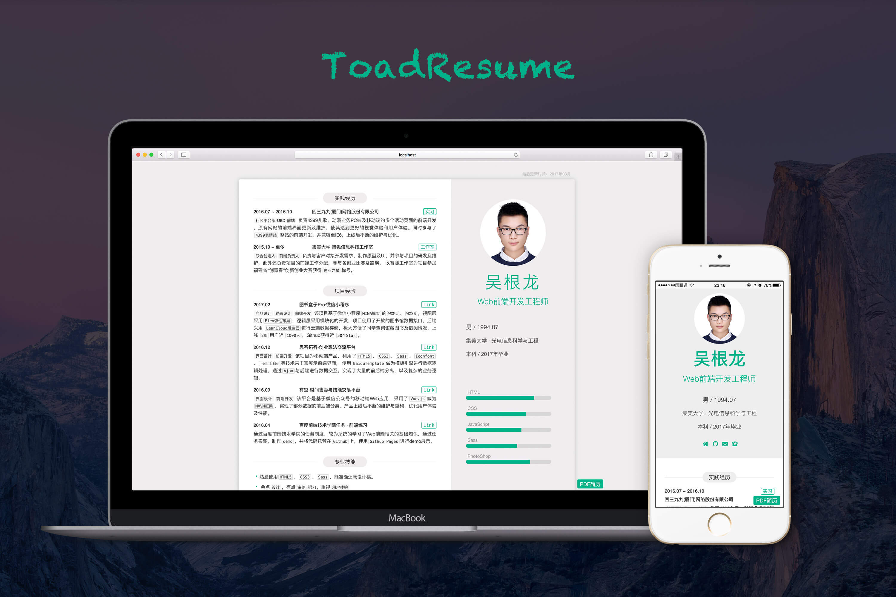

## 简历（响应式web版、psd版）
- 网页版简历 http://resume.toadw.cn

该项目的项目源自[@ Cong Min](https://congm.in) 的简历的启发

于是就根据之前自己设计的简历动手开发了`响应式Web版简历`

这样在我们下次修改的时候我只需要简单的修改`html`里面的内容即可了

该项目使用了`gulp` 、`sass`、 `compass`进行项目的构建，使用`Flexbox`做响应式布局

- Fork或者借鉴请注明出处[@ Toad](http://toadw.cn)




#### 打印方法

> chrome浏览器 - "打印" - 设置无边距 - 即可导出


#### 修改方法
1. 编辑`index.html`
2. 如需修改技能状态条，可在`scss/style.scss`里面编辑
```
//例如html状态条比例(使用flex布局中的比例)
.i-html {
     .in {flex: 8;}//.in为绿色部分比例
     .out {flex: 2;}//.out为灰色部分比例
        }
```
3. 修改完浏览器预览-打印

